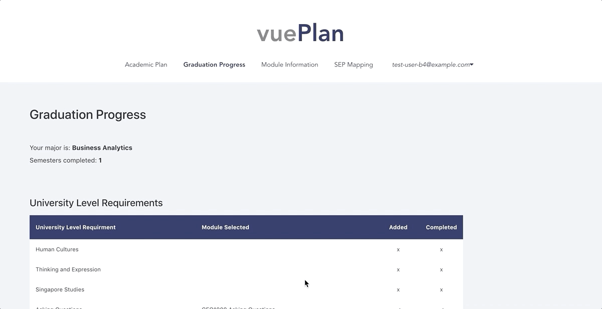
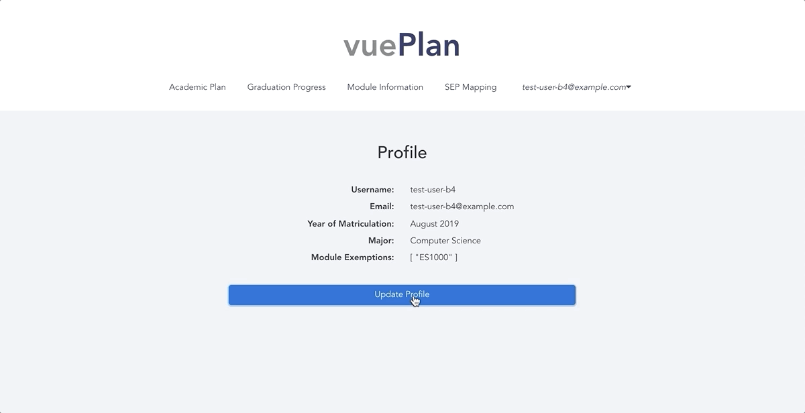

vuePlan is a web application designed to help students from the National University of Singapore (NUS) create their academic plans more efficiently.

Our application has been deployed on firebase, and can be accessed through this [link](https://vueplan.firebaseapp.com). 

## Motivation
We observed that it is currently challenging for NUS students to make academic plans. Students have to construct their own planner and manually read through their degree requirements to track their graduation progress. Students also have to search for each module’s prerequisites and preclusions before deciding when they should take a certain module. Additionally, students have to decide which electives to take, and which partner university to choose for their Student Exchange Programme (SEP), all of which influence a student’s academic plan. Thus, we wanted to develop a **centralised application** that gathers data from multiple sources used by students in academic planning, and make use of the interaction between data sources to **simplify the academic planning process**.

## Getting Started
These instructions will get you a copy of the project up and running on your local machine for development and testing purposes. 

### Install Dependencies
```
npm install
```

### Compiles and Hot-Reloads for Development
``` 
npm run serve
```
# Epics
The following are broad features that students would want in an application for academic planning, that we gathered after interacting with users.

**As a student, I want to:**
1. Plan my modules easily across semesters
2. Know what modules I am required to read so that I can graduate on time
3. Conveniently check the prerequisites that I have to fulfil before reading a module
4. Have access to module information and reviews so that I can better decide which modules to read
5. Know the popularity of modules to better gauge my likelihood of securing the module during Module Registration.
6. Know which modules I can map in various universities so that I can decide which partner universities to apply for.


## Summary of Features
### Academic Planner
- Add module to academic plan only when prerequisites are met
- Drag and drop modules across semesters provided prerequisites are met
- Delete modules from academic plan only when no other module depends on it
- Total MCs count for each semester


### Graduation Progress Checker
- Tracks the completed modules against graduation requirements
- Checks if a required module is added in the academic plan 



### Module Information
- Search bar for modules
- Module-specific description, prerequisites, preclusions and workload
- Dashboard that that shows module popularity by academic year and major
- Module ratings and reviews


### Student Exchange Programme (SEP) Module Mappings
- Search for approved SEP mappings by major or partner university


### Update User Account
- Change username, major
- Add module exemptions



## Limitations
- Due to the lack of a centralised database where we can access all NUS majors and the corresponding modules, our application only supports tracking of graduation progress for degree programmes under the School of Computing.
- No real student data was obtained for the purpose of this project. Module popularity dashboard is generated based on data input by our users.

## User Testing
The following are some of the suggestions that users have made during user testing:
- Students wanted more fine-grained metrics for module reviews. We have since edited the ratings section to include ratings on 5 dimensions: Quality of Content, Relevance of Content, Difficulty of Content, Heaviness of Workload, and Quality of Teaching Staff.
- Students wanted a more flexible SEP Mappings filter function that allows them to filter by multiple partner universities, as well as by other courses outside of their major that they might be interested in. This functionality has since been added.
- Students wanted a more visual representation of module information. Hence, we represented module workload, module prerequisites, module popularity and module ratings using various charts.

# Built With
- [Vue.js](https://vuejs.org/) 
- [Firebase](https://firebase.google.com/)

# Authors
- Lai Yan Jean -  [Github](https://github.com/laiyanjean)
- Lee Jing Xuan - [Github](https://github.com/leejx9)
- Valary Lim Wan Qian - [Github](https://github.com/ValaryLim)
- Xu Pengtai - [Github](https://github.com/Pengtai9928)
- Yang Zhenyan - [Github](https://github.com/shinkurono)